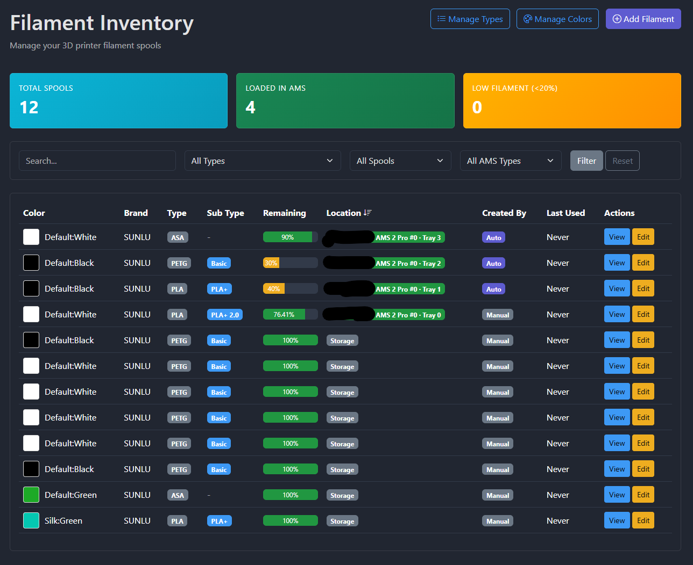

# Bambu-Run Filament Tracker

Self-hosted monitoring and filament inventory for Bambu Lab printers, with a focus on third-party filament usage in AMS setups.

This repository has diverged from the original Bambu-Run project. You are welcome to refer to the original [Bambu-Run repository](https://github.com/RunLit/Bambu-Run). The upstream README has been preserved as [OLD_README.md](OLD_README.md). This fork keeps the printer dashboard, collection service, and self-hosted deployment model, but extends filament management so non-Bambu spools can be loaded into AMS trays and deducted from local inventory.



## What This Fork Adds

- **Third-party filament inventory**: manage SUNLU, eSUN, Polymaker, Overture, and other non-Bambu spools alongside Bambu filament.
- **Global spool inventory**: inventory belongs to you, not to a specific printer.
- **Printer-scoped loading locations**: AMS units, AMS trays, and external spool slots are tied to a printer.
- **Multiple AMS support**: select the AMS unit and tray when loading a spool, including AMS 2 Pro and AMS HT style unit IDs.
- **Dashboard fallback behavior**: when a tray is not linked to a local inventory spool, the dashboard still shows the filament information reported by Bambu Cloud/MQTT.
- **Filament usage deduction**: deduct usage from locally managed third-party spools using printer job data and local print-file metadata where available.
- **Filament change handling**: supports known-leftover and unknown-leftover spool replacement cases during a print.
- **Decimal remaining values**: remaining percent and remaining weight support hand-entered values with up to 2 decimal places.
- **Global managed colors**: colors are no longer tied to filament type. A `Finish` field labels options like `Default:Black`, `Silk:Green`, or `Transparent:Clear`.
- **AMS environment display fixes**: AMS humidity uses raw `%RH` values when available.

## Setup With Docker

Copy the environment template:

```bash
cp .env.example .env
```

Edit `.env` and set at least:

```bash
BAMBU_USERNAME=your_email@example.com
BAMBU_PASSWORD=your_password
TIMEZONE=America/Los_Angeles
DJANGO_SECRET_KEY=replace-with-a-random-secret
ALLOWED_HOSTS=localhost,127.0.0.1,<your-host-ip>
CSRF_TRUSTED_ORIGINS=http://localhost:8000,http://<your-host-ip>:8000
```

Build and initialize:

```bash
docker compose build
docker compose run --rm bambu-run python standalone/manage.py migrate --noinput
docker compose run --rm bambu-run python standalone/manage.py bambu_collector --once
```

During first Bambu authentication, Bambu Lab may send a verification code by email. After authentication, save the generated token in `.env` as `BAMBU_TOKEN=...` so future container starts do not require re-auth.

Start the app:

```bash
docker compose up -d
docker compose exec bambu-run python standalone/manage.py createsuperuser
```

Open:

```text
http://<host-ip>:8000
```

## NAS Setup Notes

This app works well on a NAS or other always-on Docker host.

Keep port `8000` mapped for the web page and keep the database persistent by using the existing Docker volume:

```yaml
services:
  bambu-run:
    ports:
      - "8000:8000"
    volumes:
      - bambu_data:/app/data
```

If you want Bambu-Run to inspect local print files for offline usage estimation, mount a NAS folder into the container and point the app at it:

```yaml
services:
  bambu-run:
    ports:
      - "8000:8000"
    volumes:
      - bambu_data:/app/data
      - /volume1/prints:/prints:ro
```

Then set:

```bash
BAMBU_RUN_PRINT_FILE_DIRS=/prints
```

After code changes, rebuilding the image is usually the cleanest Docker path:

```bash
docker compose up -d --build
docker compose exec bambu-run python standalone/manage.py migrate --noinput
```

If only `.env` changed, a rebuild is not needed:

```bash
docker compose restart bambu-run
```

## First-Time Filament Workflow

1. Go to **Filament Inventory**.
2. Add a spool, for example `SUNLU PLA White`.
3. Set initial weight and remaining weight/percent. Unknown existing spools can be entered with your best estimate.
4. Enable **Loaded in AMS**.
5. Select the printer, AMS unit, and tray.
6. Save.

The dashboard should now show that local inventory spool in the matching tray. When usage data is available, Bambu-Run deducts material from the linked spool.

If no inventory spool is linked to a tray, the dashboard falls back to whatever Bambu reports for that tray instead of hiding it.

## Filament Colors And Finishes

Managed colors are global. They are not tied to PLA/PETG/ABS or any filament type.

Each color has:

- `Color Name`, for example `Black`, `Green`, `Jade White`
- `Finish`, for example `Default`, `Matte`, `Silk`, `Transparent`
- `Hex Code`, used by the color picker and swatches. Selecting a managed color automatically reflects this hex code in the color picker.

In filament forms, managed color options are displayed as:

```text
Default:Black
Silk:Green
Transparent:Clear
```

The color picker can still be edited manually for custom colors.

## Useful Commands

Run migrations:

```bash
docker compose exec bambu-run python standalone/manage.py migrate --noinput
```

Run the collector once:

```bash
docker compose exec bambu-run python standalone/manage.py bambu_collector --once
```

Follow logs:

```bash
docker compose logs -f
```

Create an admin user:

```bash
docker compose exec bambu-run python standalone/manage.py createsuperuser
```

Import bundled Bambu color catalogs:

```bash
docker compose exec bambu-run python standalone/manage.py bambu_import_colors docs/Bambu_Color_Catalog/
```

## Verification

Before committing changes, the current test target is:

```bash
python -m pytest -q
python standalone/manage.py makemigrations --check --dry-run
```

The app has test coverage for multi-AMS tray mapping, third-party filament usage deduction, decimal remaining values, dashboard fallback behavior, and global color finishes.
